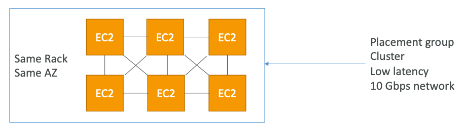
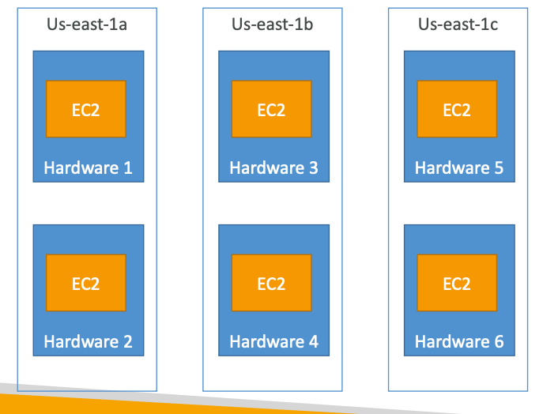
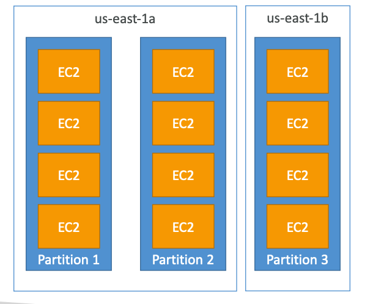

- Control over EC2 instance placement strategy
- 3 strategies for grouping the EC2 instances:
	1. **Cluster**
		- clusters instances into a low-latency group in a single AZ only
		- Same hardware for all instances
		- super low latency
		- single point of failure
		- Use Case: Big data job that needs to be completed quickly
		- 
	 2. **Spread**
		 - instances are spread across underlying hardware, **max 7 instances per AZ**
		 - best for critical applications and highly available apps
		 - reduced risk of failure
		 - higher latency
		 - 
	 3. **Partition**
		 - instances are spread across many <u>diff partitions</u> in a single AZ.
		 - each partition = same hardware
		 - **max 7 partition per AZ**
		 - Scales to 100s of EC2 instances in a group/partition.
		 - Use Case: Big data applications that use partitioning like Kafka, Cassandra, etc
		 - 