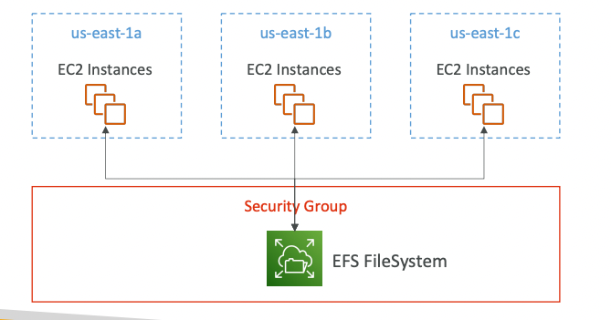

- AWS managed NFS( network file system)
- can be mounted on multiple EC2 instances
- <u>the EC2 can be different AZs</u>
- highly available
- expensive than gp2 volume
- 

# USE CASES:
- content management
- web serving
- , data sharing
- wordpress

- **Uses Security group for access control**
- <u>EFS has encryption at rest only</u>

**Scaling**:
- 1000s of concurrent clients supported
- >10Gb/s throughput
- can grow to petabyte scale of file system

**Costing**
- in EFS, you only pay for the data you are storing
- i.e cost relative the file/data size only(*like in S3*)

**Performance Modes:**

1. **General Purpose (default)**:
	- balanced and latency - sensitive
	- for web servers, CMS, etc
2. MAX IO:
	- higher throughput
	- highly parallel
	- for big data processing

**Throughput Modes:**
1. **Bursting**: 1TB size= 50mb/s throughput (figures not imp for exam)
2. **Provisioned:** set the desired throughput, irrespective of the size
3. **Elastic:** automatically scales throughput up or down based on usage 

**Storage Classes:**

1. **Based on tiers:**
	1. **Standard**: frequently accessed files
	2. **Infrequent Access (EFS - IA)**: 
		- lower cost to store, expensive to retrieve  file
		- good to use file lifecycle policy to move files from standard to IA tier.
2. **Based on availability and Durability**:
	1. **Multi AZ**: best for Production
	2. **One Zone**:
		- files are available on 1 AZ only
		- best for development
