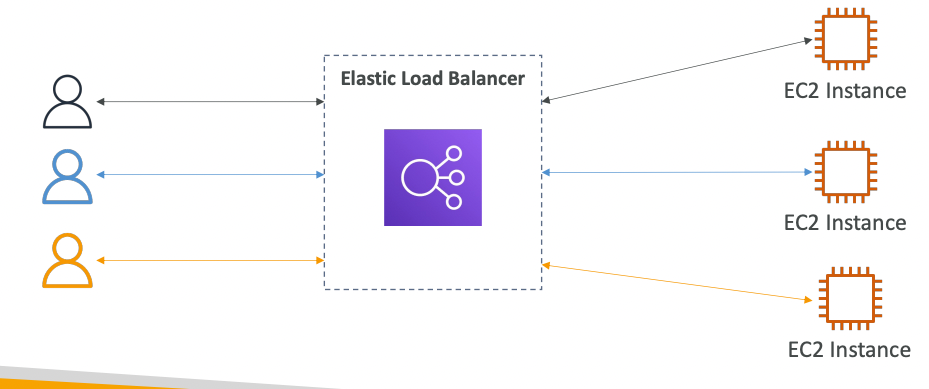
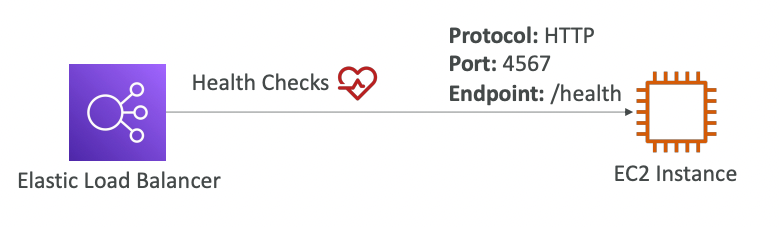

## Load Balancer
- Servers that forwards incoming traffic to one of the downstream EC2 instance
- ==responsible for distributing the load among the downstream servers==
- AWS managed service
- 

## Why & when to use LB?

1. ==spread and balance traffic== among no of downstream instances
2. ==expose only 1 point of access== to your applications deployed on multiple instances
3. Handle failures of 1 or more instances ==High availability==
4. Provides health checks for downstream instances

### Health Checks

- LB checks on each downstream instance to see if it is functional or not
- using a defined API endpoint and port (**usually /*health***)
- if response is **not 200**, 
	-  => LB will cease to send new requests to the faulty instance

