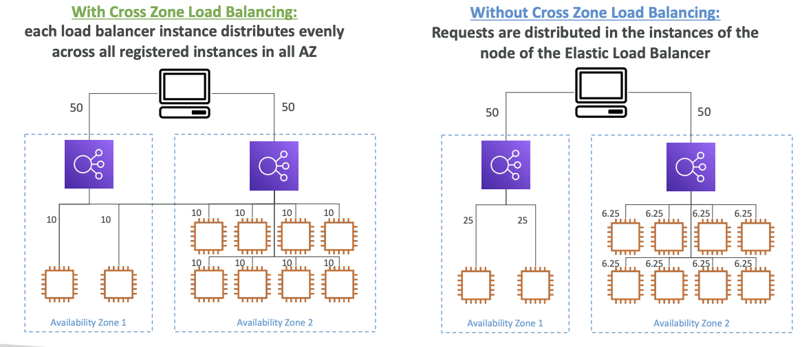

# Cross Zone Load Balancing

-  ELB  distributes traffic among all the instances across all the AZs where they are present
- 
- 

## Enable/Disabled Flag

- **ALB**
	- **Enabled by default**
	- **NO CHARGES FOR CROSS AZ Data transfer**
- NLB
	- **Disabled by default**
	- CHARGES (\$\$) for for Cross AZ data transfer