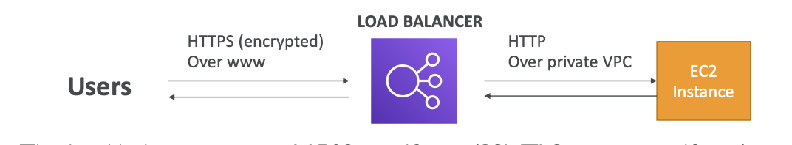

# ELB and SSL

- ELB can have SSL certificates installed and communicate with client using the certificate
- The traffic can be distributed to target groups with HTTP only over a VPC network
- ==Certificates managed by ACM (AWS Certificates Manager)==
- Can upload your own certifecates

## SNI - Server Name Indication

- Client has to mention which hostname of the target server it wants to communicate to
- Enables installing ==multiple certificates== on the ELB 
- 