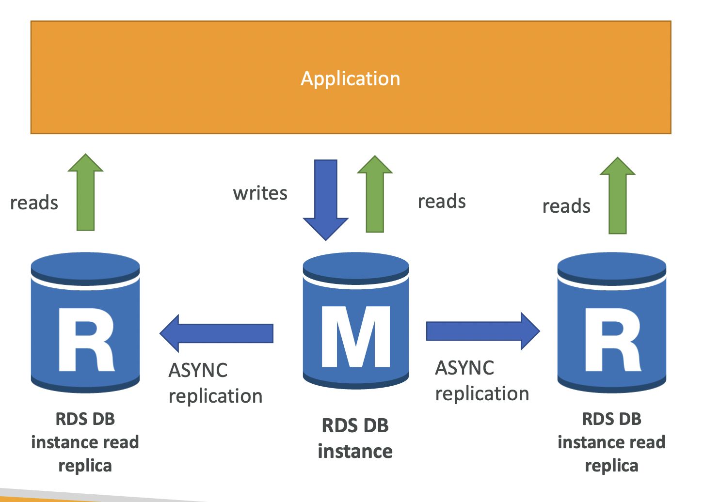

# RDS Read Replica

A replica of the current RDS instance can be created for read only purposes

- upto 15 read replicas can be created
- Read Replicas can be 
	- within same AZ
	- different AZ
	- **different Region**
- Replication is **ASYNC**
	- Any change made to main instance will be replicated over to ReadReplicas asynchronously
	- ReadReplicas will be up to date eventually not immediately.
	- 

**IMP Note**
A Read Replica ==can be promoted to a main DB if needed== 
However, ==application must update the instance url for connection==

