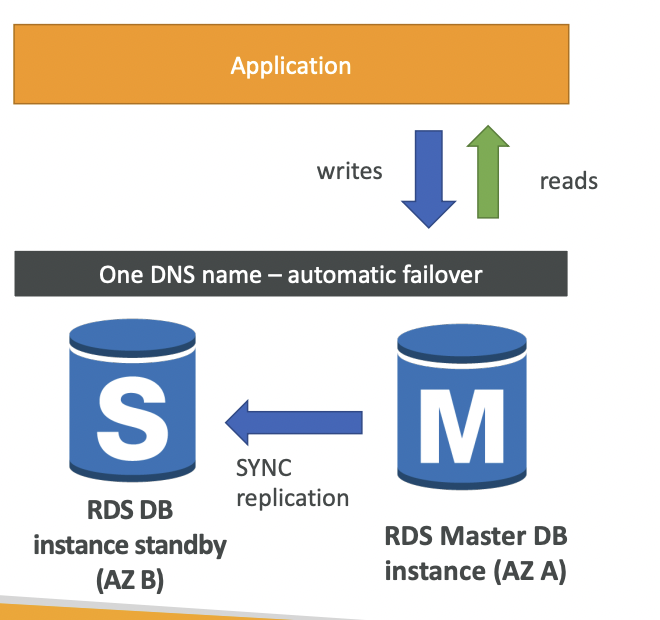

# Multi AZ (disaster recovery)

- like a **SLAVE instance** or **STANDBY** instance
- A replica of your RDS instance can be created cross AZ (same region)
- Uses **SYNC** replication
- ==Automatic Failover==
	- If main DB is down, AWS will automatically switch to Slave DB
	- Application **no need to update DB url** to connect

**IMP NOTE**
==Read Replica can be setup in multi AZ for Disaster Recovery==

## Patching & Maintenance in RDS Multi AZ

- **When patching the Operating system**:
	- The standby instance is selected first, making it unavailable
	- The patching is carried out on standby
	- The standby is promoted to be the new primary
	- The primary is selected next for patching
	- post patching, the old primary becomes the standby
- **When patching/upgrading the databse engine**
	- Both primary and standby are selected together for upgrade
	- both become unavailable during the process until up-gradation completes.
