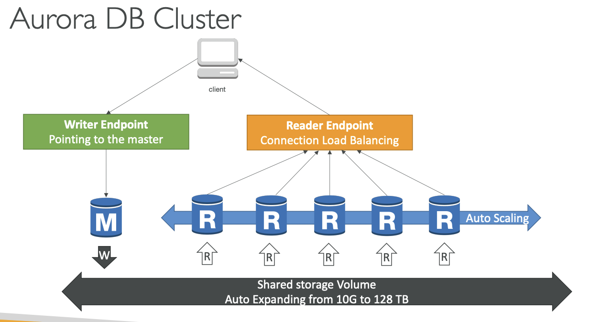

## How the Aurora Cluster works

- **Writer Endpoint**:
	- Always points to the Master DB for Writing to the shared volume
- **Reader Endpoint**
	- Load balances between multiple Read Replicas
	- Auto-Scaling of Read Replicas also happens

**==IMP: The Master and all the  Read Replicas SHARE THE SAME STORAGE==**
