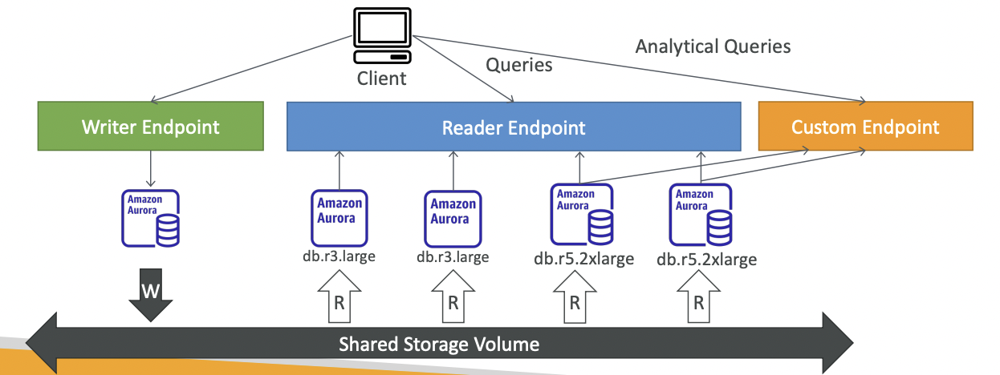

## Features

1. **High Availability**
	- Stores ==6 copies of data over 3 AZs==
	- 4 for writes, 3 for reads
	- **Self Healing Replication** - helps to recover from data corruption
2. Up to 15 Read Replicas along with 1 master
3. ==Allows cross region replication==
4. DB Backtrack: revert the DB to any point of time

# Aurora Replicas Auto Scaling

- The Read Replicas can auto scale automatically
- The reader endpoint will cover newly created replicas and load balance among them
- These replicas share common storage with the write replica as well.
- Also the read replicas will be served by a separate but common Reader endpoint

## Custom Endpoints

- A subset of Aurora instances can be covered by custom endpoints
- ==help in separating Queries by certain applications like analytics, to be served by specific instances==
