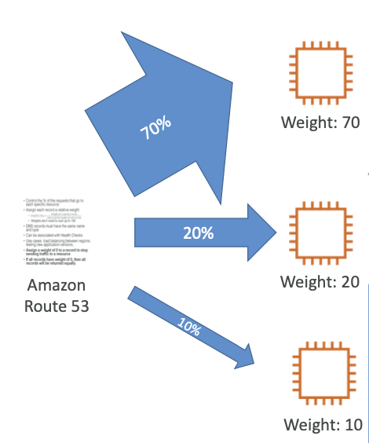

# Weighted Routing

- control % of traffic goes to which resource / ip address
- The DNS records must be of same name and types ==IMP meaning multiple DNS records can be made and they can be made to follow this routing==
- ==IMP Health Checks are allowed ✅==
- **Use Case:** Loadbalancing, Canary Release, etc

# IMP WEIGHTED ROUTING BEHAVIOUR

- **IF a record has 0 weight** ==> ❌ no traffic to that resource
- **IF ALL records have 0 weight** ===> ✅ equal distribution of the traffic among the resources
