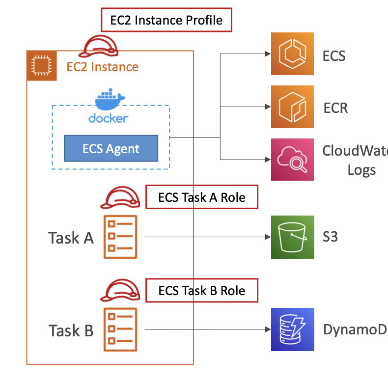

# IAM Roles for ECS

## EC2 Instance Role (==only for EC2 Launch Type)

- This IAM role is assigned to the EC2 Instance running the ECS Agent
- The **ECS Agent** assumes this role
- The IAM role enables the ECS Agent:
	- Pull images from ECR
	- Send task's logs to CloudWatch
	- API calls to ECS service
	- refer sensitive data on SSM

## Task role (==both EC2 and Fargate Launch Type)

- This IAM role is assumed by the ECS task
	- irrespective which type it is running in
- Enables the Task to access different AWS services/resource as needed
- Defined in the task definition
