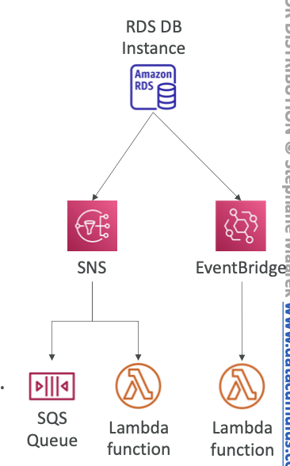

# Lambda and RDS integration (for data info only)

- Lambda function can be invoke by RDS instance 
- **helps in processing data events in databases**
- supports only RDS PostgreSQL and Aurora MySQL
- **User must allow outbound traffic from RDS to Lambda function(using NACL, VPC, etc)**
- Also IAM permissions must allow the RDS instance to call the lambda function(resource policy or IAM Role)

# RDS Event Notifications

- RDS generates notifications about the instance
	- Eg: Instance created/stopped/paused/terminated/etc
- ==**Different from above, RDS Event Notifications doesn't have data information at all**== <---- IMP
- Near Real time events
- Events can be subscribed by 
	- SNS, or
	- EventBridge
- The subscribers can then call the Lambda Function
