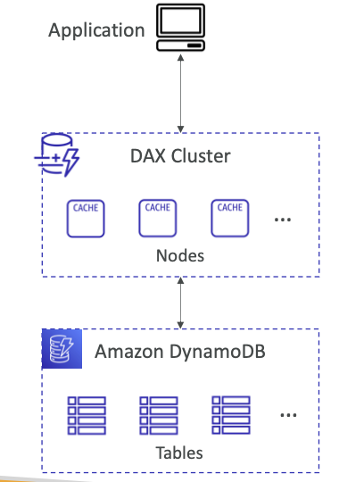

# DAX DynamoDB Accelerator

- fully managed **in-memory cache for DynamoDB**
- **Best suited for application where dynamoDB will face lot of read operations**
- read latency reduces to ==microseconds==
- Easy to integrate in application as no SDK or API changes needed

## DAX vs ElasticCache

| **DAX**                                                  | **ElasticCache**                            |
| -------------------------------------------------------- | ------------------------------------------- |
| - Best suited for caching querying and filtering results | - for storing computed or aggregated values |
