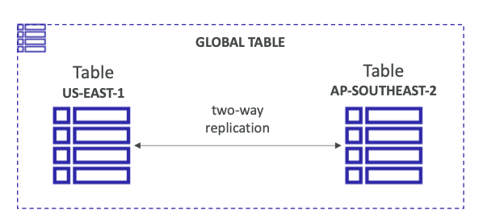
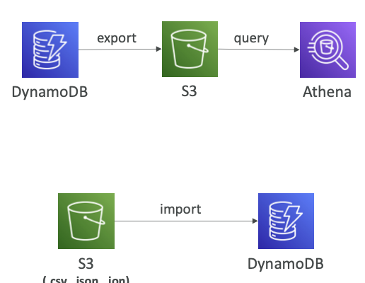

# DynamoDB Streams

- DynamoDB provides ordered stream of events/data regarding item/row changes like insert, update, delete in a table
- **Use Case:** The streams can be consumed for
	- reacting to changes in real time
	- analytics
	- cross-region replication
	- **==invoke Lambda functions on changes==** <--- IMP

## DynamoDB events into KDS/KDF

- KDS/KDF provides better streaming processing functions
- higher no of consumers can be integrated
- max 1 year of data retention

# DynamoDb Global Tables

- helps to make DynamoDB tables accessible to **each multiple regions with low latency**
- uses **Active Replication**
- Application can write to any table of any region
- ==**DynamoDB Stream MUST be ENABLED in order to enable Global Tables**==  <---- IMP

# Time To Live

- provide a expiry timestamp to a item/row in a table
- item/row is automatically deleted after the TTL timestamp passes

# Backups for Data Recovery

## Continuous backups/ Point in Time Recovery
 
- can use point-in-time recovery
	- optionally enabled for last 35 days
	- enables to restore the table to any point in time

## On-Demand backups

- full backups, retained for longer time period

# DynamoDB + S3

- data from DynamoDB table can be exported to S3
- **Requires Point-In-Time Recovery enabled in DynamoDB table**
	- covers only last 35 days
- Exporting data doesn't affect read performance
- **Use Cases**:
	- ==**Perform data analytics by exporting to S3 and using Athena to analyse S3 bucket**== <--- IMP
	- Auditing
	- ETL operations on data by hosting it on S3 then recovering it on DynamoDB
- **Data can also be imported from S3 bucket to create a new DynamoDB table**
- 

# DynamoDB Encryption

- All the tables(new and existing) are encrypted by AWS owned keys of DynamoDB **(SSE-DynamoDB)**
- **it is not possible to enable or disable it**
- 
