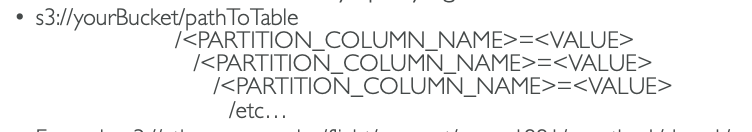

# Athena

- serverless query service
- queries the data on **S3**
- supports standard **SQL language**
- supports CSV, ORC, Parquet, etc
- Works well with **Amazon Quicksight**
	- to create dashboards
- **Use Cases:**
	- Business Intelligence report
	- ad hoc queries on
		- ELB logs
		- CloudTrails
		- VPC Flow logs

## Improving Athena Performance <-- ==IMP==

- **use columnar data for cost saving**
	- cost less due to less scan
	- **recommended format to store data is parquet or ORC**
- Use **AWS Glue** to convert data into parquet format
- Compress data for low latency retrieval
- **partition data** in S3
- 

- **Eg**: `s3://athena-example-bucket/flight/parquet/year=2020/month=0/day=31
- **Use larger file size (>128 MB)**

## Federated Query in Athena

- ==allows to run SQL query across data stored in relational, non-relational, object-based, or custom data sources== <-- IMP
- Uses aws **lambda as a Data Source Connector** to execute the Federated Query

