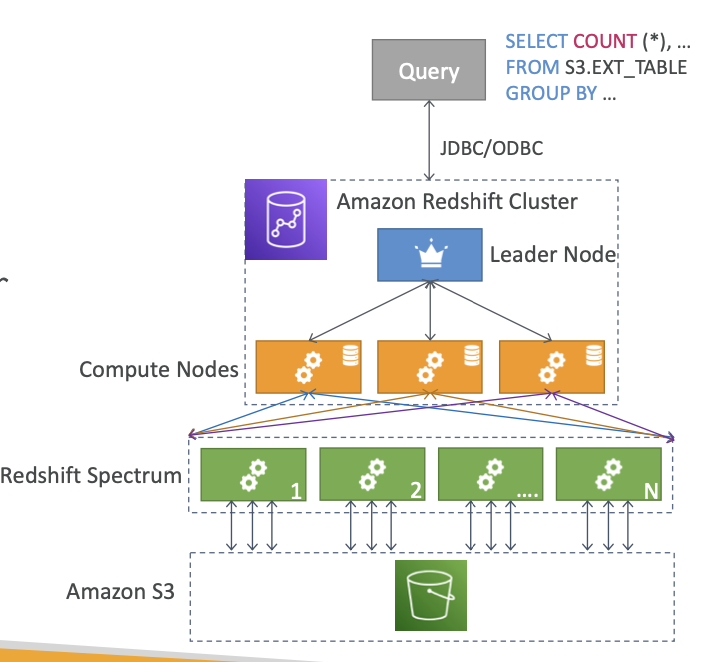

# AWS RedShift

- DB and a analytics tech
- OLAP - **OnLine Analytical Processing**
- supports PostgreSQL
- Can easily scale up to PBs of data
- Columnar Storage of data
- Can be **integrated with AWS QuickSight or Tableau**
- **RedShift is better than Athena due to faster querying/joining/aggregations**

## RedShift Cluster:

### Leader Node

- query execution planning 
- results aggregations and consolidations

### Worker Nodes

- executes the queries

## SnapShots and Disaster Recovery

- RedShift can be provisioned in Multi-AZ mode
- backups can be enabled, Point in time recovery possible
- **==RedShift cluster can be configured to automatically copy snapshots to a cluster in another AWS Region==** <-- IMP

## Ingestion of Data into RedShft

### Kinesis Data Firehose

 - KDF will dump the data into a S3 bucket first
 - Then issue a data copy command from the S3 bucket to RedShift

### Exporting from S3 Bucket using S3 Copy command

- either through internet or within VPC routing 

### EC2 Instance + JDBC Driver

# Redshift Spectrum

- **query the data on S3 without loading it on RedShift**
- RedShift cluster must be provisioned
- query is submitted to large **number of RedShift Spectrum nodes**
