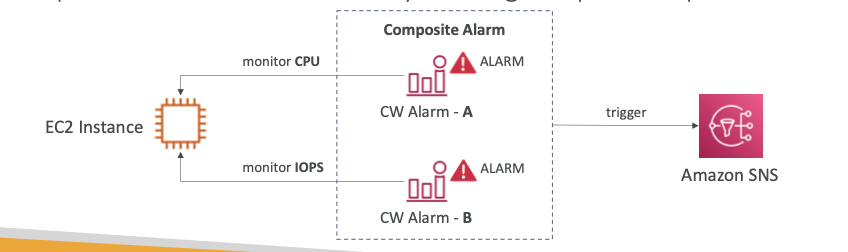

# CloudWatch Alarm

- trigger alarm/notification for any **metric**
- Different options for conditions for triggering an alarm
- 3 main Alarm States:
	- OK
	- INSUFFICIENT_DATA
	- ALARM
- The time period over which to evaluate the condition:
	- High Resolution: 10s, 30s, or 60s
	- can to be changed to higher value, multiple of 60s
- A **CloudWatch Alarm can be placed on a single metric at a time**
- **==IMP: Alarm can be created on a CloudWatch Log Filter as well==**
- To test a alarm, change the status of alarm to ALARM through AWS CLI.

## CloudWatch Alarm Targets

- On EC2 Instances
	- STOP, TERMINATE, REBOOT or RECOVER
- ON **ASG**
	- trigger auto-scale up or down
- On **SNS**:
	- Send notification to a SNS topic
	- **This is best option, as it can be used to do anything**

## Composite CloudWatchAlarm 

- **Composite Alarms can monitor states of multiple CloudWatch Alarm**
- supports **logical AND & OR**

