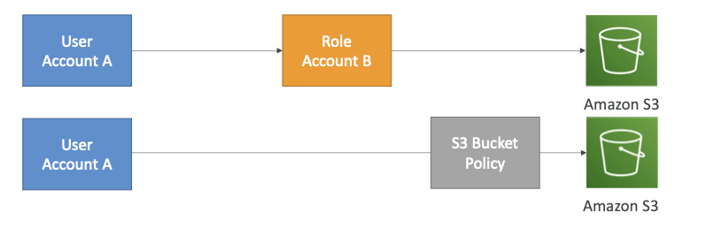

# IAM Role vs Resource Policy

- **For cross account access of resources**, there are 2 options to control the access
	- **Attach a resource based policy on the resource**
		- eg: S3 Bucket Policy
	- **Define a IAM Role which has access to the resource**
		- eg: EC2 Instance Role

### ❗️❗️❗️ IMP Catch with IAM Role for Cross Account Access 

- **When a user/application/resource assumes a IAM Role**
	- => **==It give up the original IAM permissions assigned it to it while assuming the role**
- However, *with resource based policy, the requesting user/resource doesn't lose its' original permissions*

