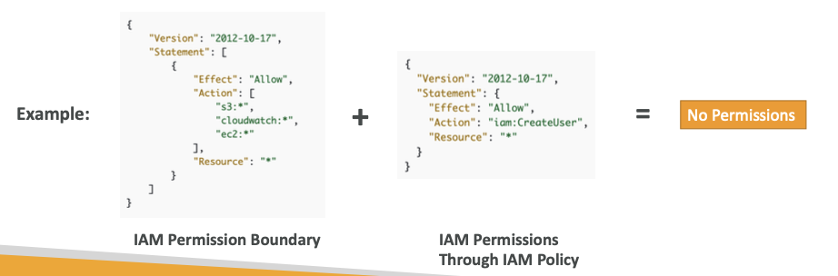
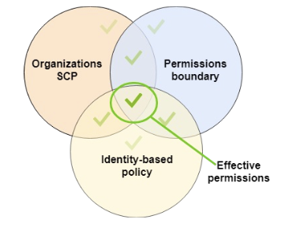

# IAM Permission Boundary

- advanced feature that controls the **maximum permissions a IAM User/role can get**
- **not for IAM Group**
- 

## IAM Permissions Boundary + Organization SCP

- Organization SCP can be combined with Permission boundary and the user's/role Permissions
- 
