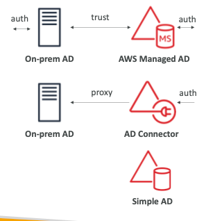
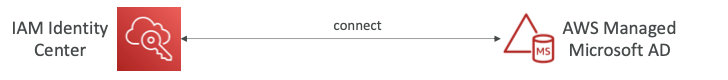
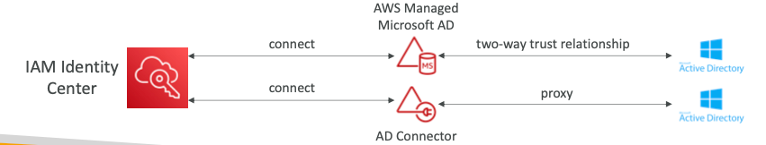

# AWS Directory Service

- provides MicroSoft Active Directory service on AWS
- 3 flavors:
	- **AWS Managed MicroSoft AD**: 
		- uses AD on AWS
		- create users locally
		- supports MFA
		- **can extend the on-prem AD using trust connections**
	- **AD Connector**
		- A proxy gateway for the on-prem AD server
		- Users are created and managed on on-prem
	- **Simple AD**:
		- complete AD compatible Directory service on AWS
		- can not be connected to the on-prem AD

## Directory Service + IAM Identity Center

- **Connecting to a AWS Managed Active Directory**
	- Integration is straightforward
	- 
- **Connecting to a on-prem Active Directory**
	- setup a new **AWS Managed Microsoft AD** / **AD Connector**
	- let the provisioned service have a trust relationship with the on-prem AD
	- Identity center can connect to the provisioned service
	- 
