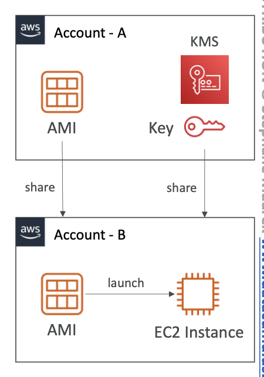

# AMI encryption

- AMI in an AWS account can be encrypted by KMS key

## Launching a encrypted AMI in another Account

1. The AMI's **Launch Permission must be updated** to allow launching in target account
2. The KMS key must be shared to the target account, **using key policy**
3. Create a IAM Role / User **in target account** having access to the AMI and KMS key
4. The EC2 instances from the AMI can be launched in the target account by the IAM Role/User.
	1. The target account user/role can further encrypt the AMI/Volume using it's own keys

