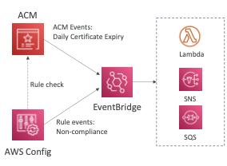

# AWS Certificate Manager

- provisions, manages and deploy TLS certificates
- helps in providing HTTPS service
- supports both **public and private certificates**
- **public certificates are FREE of COST**
- supports **auto certificate renewal**
- Easy integration with
	- **ELB**
	- **CloudFront Distribution**
	- **API Gateway**
- **❌ EC2 instances are not supported** <-- **==IMP==**
- 

## Requesting Public Certificate

1. List down the domains for which certificates is requested
	1. Can be FQDN: *corp.example.com*
	2. Can be wildcard domain: *\*.example.com*
2. Select validation method
	1. Email Validation
	2. DNS Validation <-- preferred
3. Certificate will be issues post verification 
4. Auto renewal will be setup as well

## Importing a public certificate

- an already generated Certificate (outside of ACM) can be imported as well
- **❌ There will be no automatic renewal of the certificate**

## Checking for Certificate Expiration

- ACM sends **==daily== Expiration events notification** on EventBridge ~45 days(can be changed) prior to expiry
- **AWS Config** has a ==managed rule== to check on certificate expiry

## ACM + ELB

- Incoming traffic on HTTP can be redirected to HTTPS
- this will force the use of TLS certificate

## ACM + API Gateway <-- IMP ❗️

- A **Custom Domain name** needs to be created in the API Gateway
- For different types of Endpoints in Gateway:
	- **Edge Optimized**
		- The TLS certificate must be in the **same region as CloudFront** => *us-east-1*
		- Then setup a CNAME or Alias Record in Route53
	- **Regional**
		- The TLS certificate must be imported or created on the **same region as the API Gateway**
		- Then Setup a CNAME or Alias record in Route 53