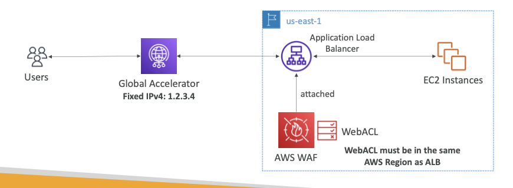

# AWS Web Application Firewall

- helps protect the web application from attack/exploits on layer 7.
- WAF can be deployed on:
	- ALB (❌ **NOT ON NLB**) <--- **==IMP==**
	- API Gateway
	- CloudFront Distribution
	- AppSync GraphQL API
	- Cognito User Pool

## WAF and Web ACLs

- ACL = Access Control List
- Rule can be defined using any of these points:
- **IP Set**
	- can set upto 10k I.P. Addresses in a rule
- **HTTP Header/Body/URI**
	- Helps against SQL Injects and XSS attack
- **Size Constraints**
- **Geo-Location Matches**
- **Rate-Limiting based rules**
- WACLs are regional based, except for CloudFront Distribution(global based)

## WACL Rule group

- a group of rules that can be added to a WACL

## ❗️❗️ How to get a Fixed IP for a ELB and apply WAF on it?

- Since WAF can be applied on Layer 7
	- => WAF is only functional on ALB not NLB
- **But if you require a fixed IP address for your ALB, how to do so?**
- ***Use the CloudFront Global Accelerator***
	- This will provide the fixed IP
	- => 

