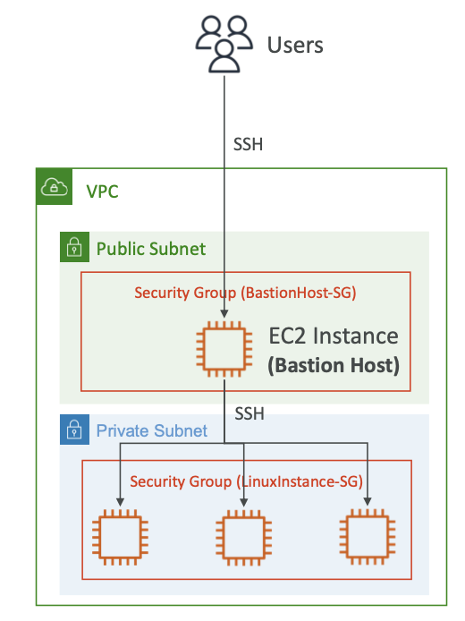

# Bastian Host

- a specialized EC2 instance deployed on "public subnet"
	- It will have it's own SG like `BastianHost-SG`

- **only this EC2 instance will be allowed to access the EC2 instance deployed on the "private subnet"**
- Users will access the Bastian Host
- Then from within the Bastian Host, it will access the EC2 instances in the private subnet
- *similar to Production Jumpboxes*

## Bastian Host SG

- this SG **must allow incoming traffic on port 22 from specific CIDR blocks(your corporate/office network) only** 
- *the SG of the EC2 instances in "private subnet" will only allow incoming traffic from the `BastianHost-SG` or from the Bastian Host's IP address only* 
