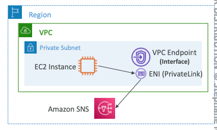

# VPC Endpoint a.k.a AWS Private Link

- Helps to access resources/AWS services **privately** ie.==without routing traffic through open internet (using NATGW + IGW)
- Resources deployed in VPC (public or private) can directly access the AWS services through AWS' private network instead
- **it is deployed on VPC level**
- highly available and redundant
- **They remove the need of IGW, NATGW, etc**

## Types of VPC Endpoints

- **Interface Endpoints:**
	- 
	- provisions an ENI(Elastic Network Interface - Elastic IP) as an entry point
	- ==The **Security Group** must be configured correctly==
	- supports most AWS services(not all)
	- costing on per hour and per GB data transfered 
- **Gateway Endpoints**
	- 
	- provisions a gateway as an entry point
	- ==the **route table** must be configured to make the gateway endpoint as a target==
	- Supports only **S3** and **DynamoDB**
	- **FREE**

## Which is more preferred? IMP ❗️❗️❗️

- In EXAM, **Gateway is more preferred due to**:
	- Free
	- Only route table needs to be configured
- *However,* **Interface Endpoint is preferred when**:
	- on-prem server needs to connect to the services, or
	- Service deployed on another VPC needs to connect
	- 