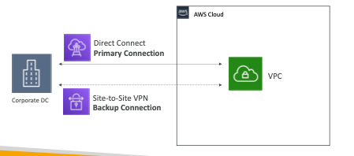

# Direct Connect - DX

- provides a **direct physical & dedicated connectio**n from a remote network into a VPC
- the connection will be between the client's Data Center/on-prem network and a **DX Location**
- **requires a Virtual Private Gateway (VGW) on the VPC side**
- enables to connect both public and private resources
- Pros:
	- increases bandwidth for larger data transfer
	- consistent network communication

## DX Gateway

- helps to make DX with **multiple VPCs**
- VPCs can be in same region or different regions

## DX Connection Types:

- **Dedicated Connections**
	- either of 1 Gbps, 10 Gbps or 100 Gbps
	- dedicated ethernet ports are provided to customer
- **Hosted Connections**
	- lower bandwidth: 50 Mbps/ 500 Mbps / 10 Gbps
	- Capacity can be added or removed by demand

## IMP for EXAM ❗️❗️❗️
**==IMP ❗️: DX establishment take at least 1 month time(can be more as well), so DX IS NOT A SOLUTION FOR URGENT NEEDS==**

## DX Encryption

- Data is ==not encrypted when in transit==
	- **But the connection is private and dedicated, so encryption will be overkill**
- **If you want to enable encryption**
	- Use VPN connection along with DX

## DX Resiliency <--- IMP FOR EXAM ❗️❗️❗️

- DX has high resiliency where each DX Connect Location has a backup already in place in case a location is down
- **for getting maximum resiliency:**
	- on each DX location, multiple direct connections can be provisioned in same data center/on-prem network

## DX + Site-to-Site VPN <--- IMP FOR EXAM ❗️❗️❗️

- the Site-to-Site VPN can be used as a backup for a DX connection.
- 
