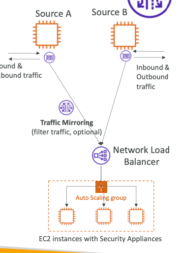

# Traffic Mirroring

- allows to capture and inspect network traffic in a VPC
- helps routing the traffic through security gateways/applications
- Capturing can be done by specifying:
	- **From/Source ENI**
	- **To/ Destination ENI/ELB** (where the Security application is working)
	- Either **ALL** or **Subset of packets using filtering** can be captured
- Source and Destination needs to be in same VPC or different VPC connected through VPC peering

