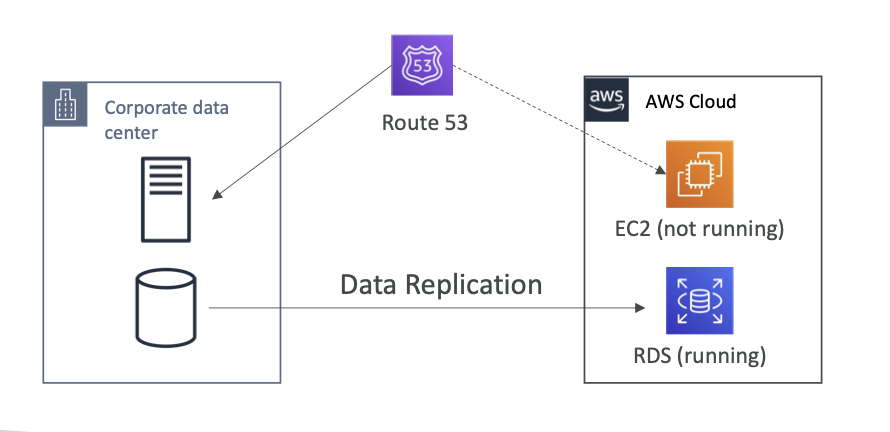

# Pilot Light

- **RPO and RTO in minutes**
- only a part of your application will be provisioned (*and maybe running*) on AWS cloud
- **eg:**
	- DB replica might be there in cloud
	- EC2 instance might be idle 
- **helpful for critical applications**
- **restore action will be faster** as application is already up and running in cloud
- 