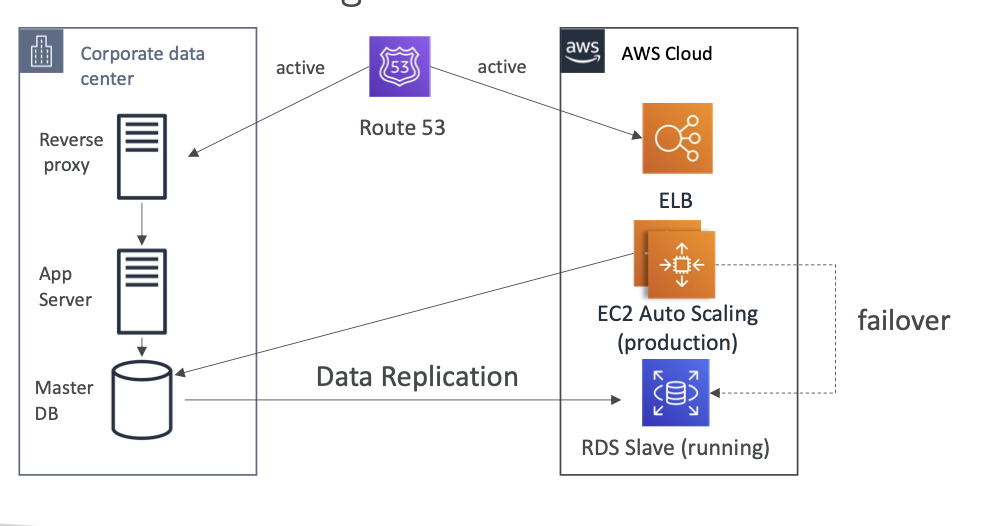
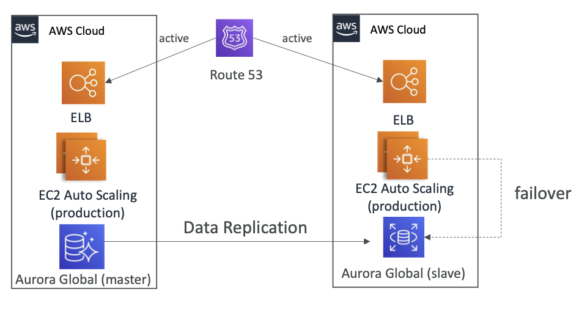

# Hot Site or Multi Site Approach

- **nil RPO and RTO**
- *most expensive as well* 😅
- **Full production scale will be running on cloud and on-prem simultaneously**
	- =>i.e with full production scale infra twice
- 

## Special Case: Multi Region Approach

- instead of a on-prem infra,
- **another set of infra can be setup on another AWS region**
- 